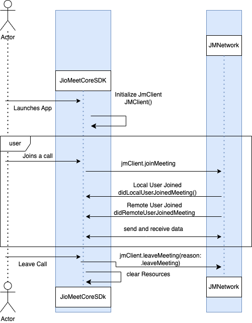

# Core SDK Documentation

## Table of Contents

1. [Introduction](#introduction)
2. [Install the SDK](#install-the-sdk)
    - [Install Via Cocoapods](#install-via-cocoapods)
3. [Prerequisites](#prerequisites)
4. [Setup](#setup)
   - [Register on JioMeet Platform](#register-on-jiomeet-platform)
   - [Get Your Application Keys](#get-your-application-keys)
   - [Get Your JioMeet Meeting ID and PIN](#get-your-jiomeet-meeting-id-and-pin)
5. [Project Settings](#project-settings)
   - [Info.plist Changes](#infoplist-changes)
   - [Enable Background Mode](#enable-background-mode)
6. [Join Meeting](#join-meeting)
   - [Create Meeting Data](#create-meeting-data)
   - [Create Meeting Configuration](#create-meeting-configuration)
   - [Create JMClient instance](#create-jmclient-instance)
   - [Join Meeting with data and config](#join-meeting-with-data-and-config)
7. [Local User Meeting Controls and Helper Methods](#local-user-meeting-controls-and-helper-methods)
   - [Mute/Unmute Local Audio](#muteunmute-local-audio)
   - [Mute/Unmute Local Video](#muteunmute-local-video)
   - [Switch Camera](#switch-camera)
   - [Start Preview](#start-preview)
   - [Stop Preview](#stop-preview)
   - [Raise Local User Hand](#raise-local-user-hand)
   - [Lower Local User Raised Hand](#lower-local-user-raised-hand)
   - [Leave Meeting](#leave-meeting)
   - [Decline Host's Audio Request](#decline-hosts-audio-request)
   - [Decline Host's Video Request](#decline-hosts-video-request)
   - [Switch Local User Role](#switch-local-user-role)
   - [Apply Virtual Background](#apply-virtual-background)
   - [Toggle Audio-Only Mode](#toggle-audio-only-mode)
8. [Public Getter Methods](#public-getter-methods)
   - [Get Local User](#get-local-user)
   - [Get Remote Users](#get-remote-users)
   - [Get All Users](#get-all-users)
9. [Remote User Meeting Controls and Helper Methods](#remote-user-meeting-controls-and-helper-methods)
   - [Subscribe Remote User Audio](#subscribe-remote-user-audio)
   - [Unsubscribe Remote User Audio](#unsubscribe-remote-user-audio)
   - [Subscribe Remote User Video](#subscribe-remote-user-video)
   - [Unsubscribe Remote User Video](#unsubscribe-remote-user-video)
   - [Hard Mute/Unmute User's Audio](#hard-muteunmute-users-audio)
   - [Soft Mute Users Audio](#soft-mute-users-audio)
   - [Lowers All Users Hands](#lowers-all-users-hands)
   - [Change Participant Audio State](#change-participant-audio-state)
   - [Change Participant Video State](#change-participant-video-state)
   - [Remove Participant From Meeting](#remove-participant-from-meeting)
   - [Change Participant User Role](#change-participant-user-role)
   - [Stop Screenshare of User](#stop-screenshare-of-user)
   - [Start Recording](#start-recording)
   - [Stop Recording](#stop-recording)
   - [Lock Meeting](#lock-meeting)
   - [UnLock Meeting](#unlock-meeting)
   - [Start Whiteboard](#start-whiteboard)
   - [Stop Whiteboard](#stop-whiteboard)
   - [Update User Co-Host Rights](#update-user-co-host-rights)
   - [Set Audio File Path for User Join Chime Sound](#set-audio-file-path-for-user-join-chime-sound)
   - [Set Audio File Path for User Left Chime Sound](#set-audio-file-path-for-user-left-chime-sound)
10. [Observe Meeting Events](#observe-meeting-events)
    - [User Failed to join the meeting](#user-failed-to-join-the-meeting)
    - [User Joined Meeting Successfully](#user-joined-meeting-successfully)
    - [Local User Audio Status Update](#local-user-audio-status-update)
    - [Local User Video Status Update](#local-user-video-status-update)
    - [Local User Hand Raise Status Update](#local-user-hand-raise-status-update)
    - [Remote User Joined Meeting](#remote-user-joined-meeting)
    - [Remote User Audio Status Update](#remote-user-audio-status-update)
    - [Remote User Video Status Update](#remote-user-video-status-update)
    - [Remote User Hand Raise Status Update](#remote-user-hand-raise-status-update)
    - [Remote User Left Meeting](#remote-user-left-meeting)
    - [Host Enable Hard Audio Mute](#host-enable-hard-audio-mute)
    - [Host Disable Hard Audio Mute](#host-disable-hard-audio-mute)
    - [Host Enable Soft Audio Mute](#host-enable-soft-audio-mute)
    - [Host Lowers all Raised Hands](#host-lowers-all-raised-hands)
    - [Meeting Data Refreshed](#meeting-data-refreshed)
    - [Loudest Speaker Detected](#loudest-speaker-detected)
    - [Network Quality Update](#network-quality-update)
    - [Network Stats Update](#network-stats-update)
    - [Network Connection State Update](#network-connection-state-update)
    - [Local ScreenShare State Change](#local-screenshare-state-change)
    - [Remote ScreenShare State Change](#remote-screenshare-state-change)
    - [Recording Started](#recording-started)
    - [Recording Stopped](#recording-stopped)
    - [Host/Co-Host Requests Participant to change Audio/Video state](#hostco-host-requests-participant-to-change-audiovideo-state)
    - [Participant Declines Request to Change Audio/Video State by Host/Co-Host](#participant-declines-request-to-change-audiovideo-state-by-hostco-host)
    - [Local User moved to Audience](#local-user-moved-to-audience)
    - [Local User moved to Participant](#local-user-moved-to-participant)
    - [Remote User moved to Audience](#remote-user-moved-to-audience)
    - [Remote User moved to Participants](#remote-user-moved-to-participants)
    - [Audio Output Route Change](#audio-output-route-change)
    - [Local User Leaves Meeting](#local-user-leaves-meeting)
    - [Meeting Locked Event](#meeting-locked-event)
    - [Meeting UnLocked Event](#meeting-unlocked-event)
    - [Local Speaker Volume Change Event](#local-speaker-volume-change-event)
    - [Local Participant Connection State Change Event](#local-participant-connection-state-change-event)
    - [Co-Host Rights Change Event](#co-host-rights-change-event)
    - [Whiteboard Started Event](#whiteboard-started-event)
    - [Whiteboard Stopped Event](#whiteboard-stopped-event)
11. [Classes, Structs and Enums](#classes-structs-and-enums)
    - [JMJoinMeetingData](#jmjoinmeetingdata)
    - [JMUserRole](#jmuserrole)
    - [JMJoinMeetingConfig](#jmjoinmeetingconfig)
    - [JMMeetingJoinError](#jmmeetingjoinerror)
    - [JMMeeting](#jmmeeting)
    - [JMMeetingUser](#jmmeetinguser)
    - [JMNetworkQuality](#jmnetworkquality)
12. [Screen Share Integration](#screen-share-integration)
    - [Add Broadcast Upload Extension](#add-broadcast-upload-extension)
    - [Add JioMeet Screen Share SDK](#add-jiomeet-screen-share-sdk)
    - [Enable App Groups](#enable-app-groups)
    - [Edit SampleHandler file](#edit-samplehandler-file)
    - [Core SDK Changes](#core-sdk-changes)    
13. [Sample App](#sample-app)    
14. [Troubleshooting](#troubleshooting)


## Introduction

In this documentation, we'll guide you through the process of installation, enabling you to enhance your iOS app with real-time communication capabilities swiftly and efficiently. Let's get started on your journey to creating seamless communication experiences with JioMeet Core SDK!



---

## Install the SDK

You can install JioMeet Core SDK via Cocoapods.

### Install Via Cocoapods

Please add `JioMeetCoreSDK_iOS` pod to your podfile and run `pod install --repo-update` command.

```ruby
target 'Your_App_Name' do
  use_frameworks!
  # Other Pods
  pod 'JioMeetCoreSDK_iOS', '2.3.1'
end
```

## Prerequisites

Before getting started with JioMeet Core SDK integration, please ensure you have the following software installed on your machine:

- Xcode 14.2 or later.
- Swift 5.0 or later.
- An iOS device or emulator running iOS 13.0 or later.

## Setup

#### Register on JioMeet Platform:

You need to first register on Jiomeet platform. [Click here to sign up](https://platform.jiomeet.com/login/signUp)

#### Get your application keys:

Create a new app. Please follow the steps provided in the [Documentation guide](https://dev.jiomeet.com/docs/quick-start/introduction) to create apps before you proceed.

#### Get your Jiomeet meeting id and pin

Use the [Create meeting api](https://dev.jiomeet.com/docs/JioMeet%20Platform%20Server%20APIs/create-a-dynamic-meeting) to get your room id and password

---

## Project Settings

### Info.plist Changes

Please add below permissions keys to your `Info.plist` file with proper description.

```swift
<key>NSCameraUsageDescription</key>
<string>Allow access to camera for meetings</string>
<key>NSMicrophoneUsageDescription</key>
<string>Allow access to mic for meetings</string>
```

### Enable Background Mode

Please enable `Background Modes` in your project `Signing & Capibilities` tab. After enabling please check box with option `Audio, Airplay, and Pictures in Pictures`. If you don't enables this setting, your mic will be muted when your app goes to background.


## Join Meeting

### Create Meeting Data

First create `JMJoinMeetingData` type object. Following are the properties of this object.

| Property Name | Type  | Description  |
| ------- | --- | --- |
| meetingId | String | Meeting ID of the meeting user is going to join. |
| meetingPin | String | Meeting PIN of the meeting user is going to join. |
| displayName | String | Display Name with which user is going to join the meeting. |

```swift
let joinMeetingData = JMJoinMeetingData(
    meetingId: "9680763133",
    meetingPin: "1tKzt",
    displayName: "John Appleased"
)
```

### Create Meeting Configuration

Create a `JMJoinMeetingConfig` type object. Following are the properties of this object.

| Property Name | Type  | Description  |
| ------- | --- | --- |
| userRole | JMUserRole | Role of the user in the meeting. Possible values are `.host`, `.speaker`, `.audience`. If you are assigning `.host` value, please pass the token in its argument. |
| isInitialAudioOn | Bool | Initial Audio State of the user when user joins the meeting. If meeting is hard muted by a host, initial audio state will be muted and this setting will not take place. |
| isInitialVideoOn | Bool | Initial Video State of the user when user joins the meeting. |

```swift
let joinMeetingConfig = JMJoinMeetingConfig(
    userRole: .host(hostToken: "MD5hQxGAwjW2"),
    isInitialAudioOn: true,
    isInitialVideoOn: true
)
```

### Create `JMClient` instance

Create a `JMClient` class instance. Use this instance to call all the SDK Methods.

```swift
let jioMeetClient = JMClient()
```

### Join Meeting with data and config

After creating `JMJoinMeetingData` and `JMJoinMeetingConfig` objects, call `joinMeeting` method of `JMClient` instance.

Following are the arguments of `joinMeeting` method.

| Argument Name | Type  | Description  |
| ------- | --- | --- |
| data | JMJoinMeetingData | Meeting Data which include meeting id, pin and user display name. |
| config | JMJoinMeetingConfig | Meeting Configuration which include user role, mic and camera initial states. |
| delegate | JMClientDelegate? | A class conforming to `JMClientDelegate` protocol.  |


```swift
jioMeetClient.joinMeeting(
    data: joinMeetingData,
    config: joinMeetingConfig,
    delegate: self
)
```

## Local User Meeting Controls and Helper Methods

Below Local Users Methods will be called via SDK `JMClient` instance.

### Mute/Unmute Local Audio

**Summary**

This method mute or unmute local user Audio.

**Declaration**

```swift
func muteLocalAudio(isMute: Bool)
```

**Important**

Please not if you are a normal user and host has done hard audio mute, you will not be able to unmute yourself. Please check wether room is hard muted or not before unmuting yourself.

**Parameters**

| Parameter Name | Type  | Description  |
| ------- | --- | --- |
| isMute | Bool | Mute or Unmute Audio. |

**Usage Example**

```swift
jioMeetClient.muteLocalAudio(isMute: true)
```

### Mute/Unmute Local Video

**Summary**

This method mute or unmute local user Video.

**Declaration**
```swift
func muteLocalVideo(isMute: Bool)
```

**Parameters**

| Parameter Name | Type  | Description  |
| ------- | --- | --- |
| isMute | Bool | Mute or Unmute Video. |

**Usage Example**

```swift
jioMeetClient.muteLocalVideo(isMute: false)
```

### Switch Camera

**Summary**

Switches between front and rear cameras.

**Declaration**
```swift
func switchCamera()
```

**Usage Example**

```swift
jioMeetClient.switchCamera()
```

### Start Preview

**Summary**

Starts the local video preview before joining a channel.

**Declaration**
```swift
func startPreview()
```

**Usage Example**

```swift
jioMeetClient.startPreview()
```

### Stop Preview

**Summary**

Stops the local video preview.

**Declaration**
```swift
func stopPreview()
```

**Usage Example**

```swift
jioMeetClient.stopPreview()
```

### Raise Local User Hand

**Summary**

Raise Local user hand in meeting.

**Declaration**

```swift
func raiseHand()
```

**Usage Example**

```swift
jioMeetClient.raiseHand()
```

### Lower Local User Raised Hand

**Summary**

Lower Local user raised hand in meeting.

**Declaration**

```swift
func lowerHand()
```

**Usage Example**

```swift
jioMeetClient.lowerHand()
```

### Leave Meeting

**Summary**

This function helps a user leave a meeting and uses a JMUserLeftReason to explain why they left.

**Declaration**

```swift
func leaveMeeting(reason: JMUserLeftReason)
```

**Parameters**

| Parameter Name | Type  | Description  |
| ------- | --- | --- |
| reason | JMUserLeftReason | Meeting left reasons such as voluntary leave, network issues, removal by the host, transitioning to an audience role, or a default undefined none state. Options are `.leaveMeeting`, `.networkDropped`, `.removedFromMeeting(byHost: String)`, `.becomeAudience`, `.none` |

**Usage Example**

```swift
jioMeetClient.leaveMeeting(reason: JMUserLeftReason)
```

### Decline Host's Audio Request

**Summary**

This function allows a participant to decline a host's request to turn on their audio during a meeting.

**Declaration**

```swift
func declineHostRequestToTurnOnAudio(host: JMMeetingUser?)
```

**Parameters**

| Parameter Name | Type  | Description  |
| ------- | --- | --- |
| host | JMMeetingUser | Host user information. |

**Usage Example**

```swift
jioMeetClient.declineHostRequestToTurnOnAudio(host: JMMeetingUser?)
```

### Decline Host's Video Request

**Summary**

This function allows a participant to decline a host's request to turn on their video during a meeting.

**Declaration**

```swift
func declineHostRequestToTurnOnVideo(host: JMMeetingUser?)
```

**Parameters**

| Parameter Name | Type  | Description  |
| ------- | --- | --- |
| host | JMMeetingUser | Host user information. |

**Usage Example**

```swift
jioMeetClient.declineHostRequestToTurnOnVideo(host: JMMeetingUser?)
```

### Switch Local User Role

**Summary**

This allows the local user to switch their role within a meeting.

**Declaration**

```swift
func switchLocalUserRole(newRole: JMUserRole)
```

**Parameters**

| Parameter Name | Type  | Description  |
| ------- | --- | --- |
| newRole | JMUserRole | Switch user roles in a meeting. Options are `.speaker`, `.audience`. |

**Usage Example**

```swift
jioMeetClient.switchLocalUserRole(newRole: JMUserRole)
```

### Apply Virtual Background

**Summary**

This function allows users to apply a virtual background of a specified type (represented by JMVirtualBackgroundType) during a meeting or video call.

**Declaration**

```swift
func applyVirtualBackground(_ type: JMVirtualBackgroundType)
```

**Parameters**

| Parameter Name | Type  | Description  |
| ------- | --- | --- |
| type | JMVirtualBackgroundType | Defines various types of virtual backgrounds. Options are `.none`, `.blur(intensity: JMVirtaulBackgroundBlurIntensity)`, `.image(path: String)`, `.color(color: UIColor)` |

**Usage Example**

```swift
jioMeetClient.applyVirtualBackground(_ type: JMVirtualBackgroundType)
```

### Toggle Audio-Only Mode

**Summary**

This function lets users switch between audio-only and regular modes during a meeting.

**Declaration**

```swift
func setAudioOnlyMode(enabled: Bool)
```

**Parameters**

| Parameter Name | Type  | Description  |
| ------- | --- | --- |
| enabled | Bool | When enabled, this feature mutes the video feed and restricts user screen share and whiteboard content. Otherwise it switches to regular mode. The available options are true or false. |

**Usage Example**

```swift
jioMeetClient.setAudioOnlyMode(enabled: true)
```

## Public Getter Methods

All the methods below are public getter methods.

### Get Local User

**Summary**

This method returns Local user object in a meeting.

**Declaration**

```swift
func getMeetingLocalUser() -> JMMeetingUser 
```

**Important**

Please call this method only when local user has joined meeting successfully.

### Get Remote Users

**Summary**

This method returns all remote users objects in a meeting.

**Declaration**

```swift
func getMeetingRemoteUsers() -> [JMMeetingUser]
```

**Important**

Please call this method only when local user has joined meeting successfully.


### Get All Users

**Summary**

This method returns all users objects in a meeting.

**Declaration**

```swift
func getMeetingUsers() -> [JMMeetingUser]
```

**Important**

Please call this method only when local user has joined meeting successfully.

## Remote User Meeting Controls and Helper Methods

All the methods below are remote user methods.

### Subscribe Remote User Audio

**Summary**

This method subscribe a remote User's audio Stream

**Declaration**

```swift
func subscribeRemoteUserAudio(id: String)
```

**Important**

When a remote user joins the meeting, by default you will not be able to hear his audio. You need to subscribe his audio by calling above method.

**Parameters**

| Parameter Name | Type  | Description  |
| ------- | --- | --- |
| id | String | id of remote user. |


### Unsubscribe Remote User Audio

**Summary**

This method unsubscribe a remote User's audio Stream

**Declaration**

```swift
func unsubscribeRemoteUserAudio(id: String)
```

**Parameters**

| Parameter Name | Type  | Description  |
| ------- | --- | --- |
| id | String | id of remote user. |


### Subscribe Remote User Video

**Summary**

This method subscribe a remote User's Video Stream

**Declaration**

```swift
func subscribeRemoteUserVideo(id: String)
```

**Important**

When a remote user joins the meeting, by default you will not be able to observe his video stream. You need to subscribe his video stream by calling above method.

**Parameters**

| Parameter Name | Type  | Description  |
| ------- | --- | --- |
| id | String | id of remote user. |

### Unsubscribe Remote User Video

**Summary**

This method unsubscribe a remote User's Video Stream

**Declaration**

```swift
func unsubscribeRemoteUserVideo(id: String)
```

**Important**

This methos is helpful in scenarios when there are lot of users in meeting but you want to display video tiles of only few users. It will reduce app resource utilisation and network bandwidth also.

**Parameters**

| Parameter Name | Type  | Description  |
| ------- | --- | --- |
| id | String | id of remote user. |


### Hard Mute/Unmute User's Audio

**Summary**

This method do hard audio mute of all users in meeting.

**Important**

This method should be called only by Host or Co-host.  Once a room is hard audio muted, only host and co-host will be able to unmute themselves.

**Declaration**

```swift
func hardMuteUnmuteUsersAudio(isMute: Bool)
```

**Parameters**

| Parameter Name | Type  | Description  |
| ------- | --- | --- |
| isMute | Bool | Wether hard mute is enabled or not. |

**Usage Example**

```swift
jioMeetClient.hardMuteUnmuteUsersAudio(isMute: true)
```

### Soft Mute Users Audio

**Summary**

This method do soft audio mute of all users in meeting.

**Important**

This method should be called only by Host or Co-host.  Once a room is soft audio muted, all users audio will be muted. Users can unmute themselves.

**Declaration**

```swift
func softMuteUsersAudio()
```

**Usage Example**

```swift
jioMeetClient.softMuteUsersAudio()
```

### Lowers All Users Hands

**Summary**

This method lowers all raised hands in the meeting.

**Important**

This method should be called only by Host or Co-host. 

**Declaration**

```swift
func lowerAllUsersHands()
```

**Usage Example**

```swift
jioMeetClient.lowerAllUsersHands()
```

### Change Participant Audio State

**Summary**

This method enables the Host or Co-host to request participants to modify their audio settings.

**Important**

This method should be called only by Host or Co-host. .

**Declaration**

```swift
func changeUserAudioState(userId: String, isOn: Bool)
```

**Parameters**

| Parameter Name | Type  | Description  |
| ------- | --- | --- |
| userId  | String | ID of the participant: JMMeetingUser. |
| isOn  | Bool | request to Mute or Unmute Audio. |

**Usage Example**

```swift
jioMeetClient.changeUserAudioState(userId: jmMeetingUser.id, isOn: true)
```

### Change Participant Video State

**Summary**

This method requests the video of the participant to modify their camera state.

**Important**

This method should be called only by Host or Co-host. 

**Declaration**

```swift
func changeUserVideoState(userId: String, isOn: Bool)
```

**Parameters**

| Parameter Name | Type  | Description  |
| ------- | --- | --- |
| userId  | String | ID of the participant: JMMeetingUser. |
| isOn  | Bool | request to enable or disable Video. |

**Usage Example**

```swift
jioMeetClient.changeUserVideoState(userId: jmMeetingUser.id, isOn: true)
```

### Remove Participant From Meeting

**Summary**

This method removes the participant from meeting.

**Important**

This method should be called only by Host or Co-host. 

**Declaration**

```swift
func removeUserFromMeeting(user: JMMeetingUser)
```

**Parameters**

| Parameter Name | Type  | Description  |
| ------- | --- | --- |
| user  | JMMeetingUser | participant: JMMeetingUser. |

**Usage Example**

```swift
jioMeetClient.removeUserFromMeeting(user: jmMeetingUser)
```

### Change Participant User Role

**Summary**

This method changes the participant user role in the meeting.

**Important**

This method should be called only by Host or Co-host.

**Declaration**

```swift
func changeUserRole(user: JMMeetingUser, newRole: JMUserRole)
```

**Parameters**

| Parameter Name | Type  | Description  |
| ------- | --- | --- |
| user  | JMMeetingUser | participant: JMMeetingUser. |
| newRole  | JMUserRole | Role of the user in the meeting. Possible values are .speaker, .audience. |

**Usage Example**

```swift
jioMeetClient.changeUserRole(user: jmMeetingUser, newRole: .audience)
```

### Stop Screenshare of User

**Summary**

This method terminates the participant's screen sharing session.

**Important**

This method should be called only by Host or Co-host. 

**Declaration**

```swift
func stopUserScreenShare(user: JMMeetingUser)
```

**Parameters**

| Parameter Name | Type  | Description  |
| ------- | --- | --- |
| user  | JMMeetingUser | participant: JMMeetingUser. |

**Usage Example**

```swift
jioMeetClient.stopUserScreenShare(user: jmMeetingUser)
```

### Start Recording

**Summary**

This method is responsible for starting screen recording. Once recording is completed recordings will be available in portal.

**Important**

This method should be called only by Host or Co-host. 

**Declaration**

```swift
func startRecording()
```

**Usage Example**

```swift
jioMeetClient.startRecording()
```

### Stop Recording

**Summary**

This method is responsible for stopping screen recording.

**Declaration**

```swift
func stopRecording()
```

**Usage Example**

```swift
jioMeetClient.stopRecording()
```

### Lock Meeting

**Summary**

This method is responsible for locking the current meeting session, once we lock the meeting no new remote participants can join until meeting is un-locked.

**Important**

This method should be called only by Host or Co-host. 

**Declaration**

```swift
func lockMeeting()
```

**Usage Example**

```swift
jioMeetClient.lockMeeting()
```

### UnLock Meeting

**Summary**

This method is responsible for unlocking the current meeting session, once un-lock new remote participants can join the meeting.

**Important**

This method should be called only by Host or Co-host. 

**Declaration**

```swift
func unLockMeeting()
```

**Usage Example**

```swift
jioMeetClient.unLockMeeting()
```

### Start Whiteboard

**Summary**

This method initializes the whiteboard feature for a meeting session. It can be used to start a whiteboard session either locally or for remote whiteboard rendering as well.

**Declaration**

```swift
func startWhitebboard(remote: Bool, startedBy: String)
```

**Parameters**

| Parameter Name | Type  | Description  |
| ------- | --- | --- |
| remote | Bool | Determines local or remote user. Options are true/false. |
| startedBy | startedBy | Name of the user. |

**Usage Example**

```swift
jioMeetClient.startWhitebboard(remote: true, startedBy: senderName)
```

### Stop Whiteboard

**Summary**

This method is responsible for ending the whiteboard session within a meeting.

**Declaration**

```swift
func stopWhiteboard()
```

**Usage Example**

```swift
jioMeetClient.stopWhiteboard()
```

### Update User Co-Host Rights

**Summary**

This method facilitates the modification of co-host rights for a specific user within a meeting.

**Important**

This method should be called only by Host or Co-host. 

**Declaration**

```swift
func updateUserCoHostRights(user: JMMeetingUser, makeCoHost: Bool)
```

**Parameters**

| Parameter Name | Type  | Description  |
| ------- | --- | --- |
| user | JMMeetingUser | Participant user within the meeting. |
| makeCoHost | Bool | Update coHost rights. Options are true/false. |

**Usage Example**

```swift
jioMeetClient.updateUserCoHostRights(user: jmMeetingUser, makeCoHost: true)
```

### Set Audio File Path for User Join Chime Sound

**Summary**

This function configures the audio file path for the chime sound, which is provided by the client app, to notify the Host/Co-Host when a user joins the meeting.

**Declaration**

```swift
func setAudioFilePathForUserJoin(filePath: String)
```

**Parameters**

| Parameter Name | Type  | Description  |
| ------- | --- | --- |
| filePath | String | The file path to an audio file. |

**Usage Example**

```swift
jioMeetClient.setAudioFilePathForUserJoin(filePath: entryChimeSoundPath)
```

### Set Audio File Path for User Left Chime Sound

**Summary**

This function configures the audio file path for the chime sound, which is provided by the client app, to notify the Host/Co-Host when a user leaves the meeting.

**Declaration**

```swift
func setAudioFilePathForUserLeft(filePath: String)
```

**Parameters**

| Parameter Name | Type  | Description  |
| ------- | --- | --- |
| filePath | String | The file path to an audio file. |

**Usage Example**

```swift
jioMeetClient.setAudioFilePathForUserLeft(filePath: exitChimeSoundPath)
```

## Observe Meeting Events

The methods of `JMClientDelegate` will be triggered by JioMeet SDK to notify updates happening in the meeting like user join/leave meeting, mic/video status updates of local and remote users, etc.

Following are the methods of `JMClientDelegate` protocol

### User Failed to join the meeting

**Summary**

Triggered when Local User Failed to join a meeting due to some error.

**Declaration**

```swift
func jmClient(didLocalUserFailedToJoinMeeting error: JMMeetingJoinError)
```

**Parameters**

| Parameter Name | Type  | Description  |
| ------- | --- | --- |
| error | JMMeetingJoinError | Error Occurred when user try to join a meeting. |


### User Joined Meeting Successfully

**Summary**

Triggered when Local User Successfully joined a meeting.

**Declaration**

```swift
func jmClient(_ meeting: JMMeeting, didLocalUserJoinedMeeting user: JMMeetingUser)
```

**Parameters**

| Parameter Name | Type  | Description  |
| ------- | --- | --- |
| meeting | JMMeeting | Meeting Object which User joined. |
| user | JMMeetingUser | User information like display name, audio track, video track and other meta data. |


### Local User Audio Status Update

**Summary**

Triggered when Local User Audio State is changed.

**Declaration**

```swift
func jmClient(_ meeting: JMMeeting, didLocalUserMicStatusUpdated isMuted: Bool)
```

**Discussion**

Update your UI and properties either on the basis of isMuted property.

**Parameters**

| Parameter Name | Type  | Description  |
| ------- | --- | --- |
| meeting | JMMeeting | Current Joined Meeting Object. |
| isMuted | Bool | Audio Muted or not. |


### Local User Video Status Update

**Summary**

Triggered when Local User Video State is changed.

**Declaration**

```swift
func jmClient(_ meeting: JMMeeting, didLocalUserVideoStatusUpdated isMuted: Bool)
```

**Discussion**

Update your UI and properties either on the basis of isMuted property or isVideoMuted of user parameter.

**Parameters**

| Parameter Name | Type  | Description  |
| ------- | --- | --- |
| meeting | JMMeeting | Current Joined Meeting Object. |
| isMuted | Bool | Video Muted or not. |


### Local User Hand Raise Status Update

**Summary**

Triggered when Local User Hand Raise State is changed.

**Declaration**

```swift
func jmClient(_ meeting: JMMeeting, didLocalUserHandRaiseStatusUpdated isRaised: Bool)
```

**Discussion**

Update your UI and properties either on the basis of isRaised property or isHandRaised of user parameter.

**Parameters**

| Parameter Name | Type  | Description  |
| ------- | --- | --- |
| meeting | JMMeeting | Current Joined Meeting Object. |
| isRaised | Bool | Hand Raised or not. |


### Remote User Joined Meeting

**Summary**

Triggered when a remote Users Joined a meeting.

**Declaration**

```swift
func jmClient(_ meeting: JMMeeting, didRemoteUserJoinedMeeting user: JMMeetingUser)
```

**Discussion**

By default, remote user’s video and audio will be muted for local user. You need to subscibe his audio and video streams by calling `subscribeRemoteUserAudio` and `subscribeRemoteUserVideo` methods of `JMClient` instance.

**Parameters**

| Parameter Name | Type  | Description  |
| ------- | --- | --- |
| meeting | JMMeeting | Current Joined Meeting Object. |
| user | JMMeetingUser | Remote User Information. |


### Remote User Audio Status Update

**Summary**

Triggered when a remote Users Mic state is updated.

**Declaration**

```swift
func jmClient(_ meeting: JMMeeting, didRemoteUserMicStatusUpdated user: JMMeetingUser, isMuted: Bool)
```

**Discussion**

This event, will be triggered when either remote user mute/unmute his audio or when local user subscribe or unsubscribe respective remote user audio stream

**Parameters**

| Parameter Name | Type  | Description  |
| ------- | --- | --- |
| meeting | JMMeeting | Current Joined Meeting Object. |
| user | JMMeetingUser | Remote User Information. |
| isMuted | Bool | Audio Muted or not. |


### Remote User Video Status Update

**Summary**

Triggered when a remote Users Video state is updated.

**Declaration**

```swift
func jmClient(_ meeting: JMMeeting, didRemoteUserVideoStatusUpdated user: JMMeetingUser, isMuted: Bool)
```

**Discussion**

This event, will be triggered when either remote user mute/unmute his video or when local user subscribe or unsubscribe respective remote user video stream.

**Parameters**

| Parameter Name | Type  | Description  |
| ------- | --- | --- |
| meeting | JMMeeting | Current Joined Meeting Object. |
| user | JMMeetingUser | Remote User Information. |
| isMuted | Bool | Video Muted or not. |


### Remote User Hand Raise Status Update

**Summary**

Triggered when a remote Users Hand Raised State is updated.

**Declaration**

```swift
func jmClient(_ meeting: JMMeeting, didRemoteUserHandRaiseStatusUpdated user: JMMeetingUser, isRaised: Bool)
```

**Discussion**

This event, will be triggered when either remote user lowers his hand or a host/co-host lowered all users hand

**Parameters**

| Parameter Name | Type  | Description  |
| ------- | --- | --- |
| meeting | JMMeeting | Current Joined Meeting Object. |
| user | JMMeetingUser | Remote User Information. |
| isRaised | Bool | Hand Raised or not. |


### Remote User Left Meeting

**Summary**

Triggered when a remote Users leaves the meeting.

**Declaration**

```swift
func jmClient(_ meeting: JMMeeting, didRemoteUserLeftMeeting user: JMMeetingUser, reason: JMUserLeftReason)
```

**Parameters**

| Parameter Name | Type  | Description  |
| ------- | --- | --- |
| meeting | JMMeeting | Current Joined Meeting Object. |
| user | JMMeetingUser | Remote User who left meeting. |
| reason | JMUserLeftReason | Reason why User Left meeting. Possible values are `.leaveMeeting` and `.networkDropped`. |


### Host Enable Hard Audio Mute

**Summary**

Triggered When a Host/Co-Host Enables Hard Audio Mute

**Declaration**

```swift
func jmClient(_ meeting: JMMeeting, didHostEnableHardAudioMute host: JMMeetingUser?)
```

**Discussion**

When a room is hard audio muted, all users audio will be muted. Only Host or Co-hosts can unmute themselves. If any user who is not a host or co-host try to unmute himself when hard mute is enabled, Error Delegate method will be triggered.
Once hard audio mute is disabled, users can unmute themselves.

**Parameters**

| Parameter Name | Type  | Description  |
| ------- | --- | --- |
| meeting | JMMeeting | Current Joined Meeting Object. |
| host | JMMeetingUser | Host user who perform this action. |


### Host Disable Hard Audio Mute

**Summary**

Triggered When a Host/Co-Host disables Hard Audio Mute.

**Declaration**

```swift
func jmClient(_ meeting: JMMeeting, didHostDisableHardAudioMute host: JMMeetingUser?)
```

**Discussion**

Once hard audio mute is disabled, users can unmute themselves.

**Parameters**

| Parameter Name | Type  | Description  |
| ------- | --- | --- |
| meeting | JMMeeting | Current Joined Meeting Object. |
| host | JMMeetingUser | Host user who perform this action. |


### Host Enable Soft Audio Mute

**Summary**

Triggered When a Host/Co-Host Enable Soft Audio Mute.

**Declaration**

```swift
func jmClient(_ meeting: JMMeeting, didHostEnableSoftAudioMute host: JMMeetingUser?)
```

**Discussion**

When a room is soft audio muted, all users audio will be muted. Users can unmute themselves.

**Parameters**

| Parameter Name | Type  | Description  |
| ------- | --- | --- |
| meeting | JMMeeting | Current Joined Meeting Object. |
| host | JMMeetingUser | Host user who perform this action. |


### Host Lowers all Raised Hands

**Summary**

Triggered When a Host/Co-Host lower all raised hands.

**Declaration**

```swift
func jmClient(_ meeting: JMMeeting, didHostLowerAllHands host: JMMeetingUser?)
```

**Discussion**

When this event occurs, all users hands will be lowered.

**Parameters**

| Parameter Name | Type  | Description  |
| ------- | --- | --- |
| meeting | JMMeeting | Current Joined Meeting Object. |
| host | JMMeetingUser | Host user who perform this action. |


### Meeting Data Refreshed

**Summary**

Triggered Periodically after 25 Seconds or When App switch state from inactive to active state or When your connection is restored if it was disconnected.

**Declaration**

```swift
func jmClient(_ meeting: JMMeeting, didMeetingDataRefreshed reason: JMMeetingDataRefreshReason)
```

**Discussion**

Use this to Refresh your current local meeting data and Update UI.

**Parameters**

| Parameter Name | Type  | Description  |
| ------- | --- | --- |
| meeting | JMMeeting | Current Joined Meeting Object. |
| reason | JMMeetingDataRefreshReason | Reason for refresh. |


### Loudest Speaker Detected

**Summary**

This event will notify loudest speaker in the meeting.

**Declaration**

```swift
func jmClient(_ meeting: JMMeeting, didLoudestSpeakerUpdated user: JMMeetingUser?)
```

**Discussion**

If user object is nil, it means there is no active loudest user.


**Parameters**

| Parameter Name | Type  | Description  |
| ------- | --- | --- |
| meeting | JMMeeting | Current Joined Meeting Object. |
| user | JMMeetingUser | Loudest User object. |


### Network Quality Update

**Summary**

The SDK triggers this callback once every two seconds to report the network quality of local user in meeting. If local user is not sending or recieving any audio or video stream, then you will get value as `.detecting`.

**Declaration**

```swift
func jmClient(_ meeting: JMMeeting, didNetworkQualityUpdated quality: JMNetworkQuality)
```

**Parameters**

| Parameter Name | Type  | Description  |
| ------- | --- | --- |
| meeting | JMMeeting | Current Joined Meeting Object. |
| quality | JMNetworkQuality | Network Quality. Possible values are `.good`, `.low`, `.bad` and `.detecting`. |

### Network Stats Update

**Summary**

The SDK triggers this callback once every two seconds to report the statistics of the current meeting.

**Declaration**

```swift
func jmClient(_ meeting: JMMeeting, didMeetingNetworkStatsUpdated stats: JMMeetingNetworkStats)
```

**Parameters**

| Parameter Name | Type  | Description  |
| ------- | --- | --- |
| meeting | JMMeeting | Current Joined Meeting Object. |
| stats | JMMeetingNetworkStats | Network stats info like uplink/downlink packet loss, latency, etc. |

### Network Connection State Update

**Summary**

This method triggers every second to monitor and manage the participant's connection to the server, network status, and socket service.

**Declaration**

```swift
func jmClient(_ meeting: JMMeeting, didNetworkConnectedStateUpdated isConnected: Bool)
```

**Parameters**

| Parameter Name | Type  | Description  |
| ------- | --- | --- |
| meeting | JMMeeting | Current Joined Meeting Object. |
| isConnected | Bool | Updates regarding Network connection status. |

### Local ScreenShare State Change

**Summary**

This method is triggered when the local screen share status changed.
**Declaration**

```swift
func jmClient(_ meeting: JMMeeting, didLocalScreenShareStateChanged state: JMScreenShareState)
```

**Parameters**

| Parameter Name | Type  | Description  |
| ------- | --- | --- |
| meeting | JMMeeting | Current Joined Meeting Object. |
| state | JMScreenShareState | Defines the possible states of a screen sharing session, possible states are `.started(mediaTrack: JMScreenShareTrack)`, `.stopped` |

### Remote ScreenShare State Change

**Summary**

This method is triggered when a participant screen share status changed.

**Declaration**

```swift
func jmClient(_ meeting: JMMeeting, didRemoteScreenShareStateChanged state: JMScreenShareState)
```

**Parameters**

| Parameter Name | Type  | Description  |
| ------- | --- | --- |
| meeting | JMMeeting | Current Joined Meeting Object. |
| state | JMScreenShareState | Defines the possible states of a screen sharing session, possible states are `.started(mediaTrack: JMScreenShareTrack)`, `.stopped` |

### Recording Started

**Summary**

This method is triggered when the user started the recording.

**Declaration**

```swift
func jmClient(_ meeting: JMMeeting, didRecordingStarted user: JMMeetingUser?)
```

**Parameters**

| Parameter Name | Type  | Description  |
| ------- | --- | --- |
| meeting | JMMeeting | Current Joined Meeting Object. |
| user | JMMeetingUser | User who has started the recording. If user is nil recording is automatically start by server. |

### Recording Stopped

**Summary**

This method is triggered when the user stopped the recording.

**Declaration**

```swift
func jmClient(_ meeting: JMMeeting, didRecordingStopped user: JMMeetingUser?)
```

**Parameters**

| Parameter Name | Type  | Description  |
| ------- | --- | --- |
| meeting | JMMeeting | Current Joined Meeting Object. |
| user | JMMeetingUser | User who has stopped the recording. If user is nil recording is automatically stopped by server. |

### Host/Co-Host Requests Participant to change Audio/Video state

**Summary**

This method is triggered when the Host/Co-Host request the participant user to change their audio or video state.

**Declaration**

```swift
func jmClient(_ meeting: JMMeeting, didHostRequestToChangeAudioVideoState host: JMMeetingUser?, state: AudioVideoState)
```

**Parameters**

| Parameter Name | Type  | Description  |
| ------- | --- | --- |
| meeting | JMMeeting | Current Joined Meeting Object. |
| host | JMMeetingUser | Host information.  |
| state | AudioVideoState | Defines the possible states of a audio and video, possible states are `.startAudio`, `.stopAudio`, `.startVideo`, `.stopVideo`  |

### Participant Declines Request to Change Audio/Video State by Host/Co-Host

**Summary**

This method is triggered when the participant user declining a request initiated by a host or co-host to change their audio/video state during a meeting session.

**Declaration**

```swift
func jmClient(_ meeting: JMMeeting, didUserDeclineToChangeAudioVideoState user: JMMeetingUser?, state: AudioVideoState)
```

**Parameters**

| Parameter Name | Type  | Description  |
| ------- | --- | --- |
| meeting | JMMeeting | Current Joined Meeting Object. |
| user | JMMeetingUser | User information.  |
| state | AudioVideoState | Defines the possible states of a audio and video, possible states are `.startAudio`, `.stopAudio`, `.startVideo`, `.stopVideo`  |

### Local User moved to Audience

**Summary**

This method is triggered when the Local user's role is changed to Audience within a meeting session.

**Declaration**

```swift
func jmClient(_ meeting: JMMeeting, didLocalUserMovedToAudience user: JMMeetingUser?)
```

**Parameters**

| Parameter Name | Type  | Description  |
| ------- | --- | --- |
| meeting | JMMeeting | Current Joined Meeting Object. |
| user | JMMeetingUser | User information.  |

### Local User moved to Participant

**Summary**

This method is triggered when the Local user's role is changed to Participant within a meeting session.

**Declaration**

```swift
func jmClient(_ meeting: JMMeeting, didLocalUserMovedToParticipant user: JMMeetingUser?)
```

**Parameters**

| Parameter Name | Type  | Description  |
| ------- | --- | --- |
| meeting | JMMeeting | Current Joined Meeting Object. |
| user | JMMeetingUser | Local user information.  |

### Remote User moved to Audience

**Summary**

This method is triggered when the remote user's role is changed to Audience within a meeting session.

**Declaration**

```swift
func jmClient(_ meeting: JMMeeting, didUserMovedToAudience user: JMMeetingUser?)
```

**Parameters**

| Parameter Name | Type  | Description  |
| ------- | --- | --- |
| meeting | JMMeeting | Current Joined Meeting Object. |
| user | JMMeetingUser | User information.  |

### Remote User moved to Participants

**Summary**
This method is triggered when the remote user's role is changed to Participant within a meeting session.

**Declaration**

```swift
func jmClient(_ meeting: JMMeeting, didUserMovedToParticipants user: JMMeetingUser?)
```

**Parameters**

| Parameter Name | Type  | Description  |
| ------- | --- | --- |
| meeting | JMMeeting | Current Joined Meeting Object. |
| user | JMMeetingUser | User information.  |


### Audio Output Route Change

**Summary**

The SDK triggers this callback when the local audio route changes. For e.g. when user has connected headphone or bluetooth earphone, this will notify that your audio output will be via respective audio route.

**Declaration**

```swift
func jmClient(_ meeting: JMMeeting, didAudioOutputRouteChanged newRoute: JMAudioRouteType)
```

**Parameters**

| Parameter Name | Type  | Description  |
| ------- | --- | --- |
| meeting | JMMeeting | Current Joined Meeting Object. |
| newRoute | JMAudioRouteType | Audio output route. Please check all values. |


### Local User Leaves Meeting

**Summary**

Triggered when Local User leaves a meeting.

**Declaration**

```swift
func jmClient(_ meeting: JMMeeting, didLocalUserLeftMeeting reason: JMUserLeftReason)
```

**Discussion**

Once local user left meeting, no more events will be notified by the SDK to your app. Please call below method to release all resources used by SDK.

```swift
jioMeetClient.delegate = nil
```

### Meeting Locked Event

**Summary**

It is triggered when a meeting is locked by the host.

**Declaration**

```swift
func jmClient(_ meeting: JMMeeting, didMeetingLocked host: JMMeetingUser?)
```

**Parameters**

| Parameter Name | Type  | Description  |
| ------- | --- | --- |
| meeting | JMMeeting | Current Joined Meeting Object. |
| host | JMMeetingUser | Host information. |

### Meeting UnLocked Event

**Summary**

It is triggered when a meeting is unlocked by the host

**Declaration**

```swift
func jmClient(_ meeting: JMMeeting, didMeetingUnLocked host: JMMeetingUser?)
```

**Parameters**

| Parameter Name | Type  | Description  |
| ------- | --- | --- |
| meeting | JMMeeting | Current Joined Meeting Object. |
| host | JMMeetingUser | Host information. |

### Local Speaker Volume Change Event

**Summary**

It is triggered when the local user's speaker volume level changes.

**Declaration**

```swift
func jmClient(_ meeting: JMMeeting, didLocalSpeakerVolumeChanges newLevel: Int, localUserSpeaking: Bool)
```

**Parameters**

| Parameter Name | Type  | Description  |
| ------- | --- | --- |
| meeting | JMMeeting | Current Joined Meeting Object. |
| newLevel | Int | speaker volume level. |
| localUserSpeaking | Bool | Determines local user starts or stops speaking Options are true/false. |


### Local Participant Connection State Change Event

**Summary**

It is triggered when the connection state of the local participant changes to a new state. 

**Declaration**

```swift
func jmClient(_ meeting: JMMeeting, didLocalParticipantConnectionChangedTo state: JMConnectionState)
```

**Parameters**

| Parameter Name | Type  | Description  |
| ------- | --- | --- |
| meeting | JMMeeting | Current Joined Meeting Object. |
| state | JMConnectionState | Defines different states that represent the network connection status, Options are `.disconnected`, `.connecting`, `.connected`, `.reconnecting`, `.failed`|

### Co-Host Rights Change Event

**Summary**

It is triggered when the co-host rights for a specific user are modified.

**Declaration**

```swift
func jmClient(_ meeting: JMMeeting, didCoHostRightsChanged user: JMMeetingUser, isCoHost: Bool)
 ```

**Parameters**

| Parameter Name | Type  | Description  |
| ------- | --- | --- |
| meeting | JMMeeting | Current Joined Meeting Object. |
| user | JMMeetingUser | Participant user. |
| isCoHost | Bool | Determines whether the is the CoHost, Options are true/false. |

### Whiteboard Started Event

**Summary**

It is triggered when a whiteboard session is started within a meeting.

**Declaration**

```swift
func jmClient(_ meeting: JMMeeting, didWhiteboardStarted user: JMMeetingUser, isHost: Bool, whiteboardUrl: String)
 ```

**Parameters**

| Parameter Name | Type  | Description  |
| ------- | --- | --- |
| meeting | JMMeeting | Current Joined Meeting Object. |
| user | JMMeetingUser | Participant user. |
| isHost | Bool | Determines whether the user is the Host, Options are true/false. |
| whiteboardUrl | String |  URL to start the Whiteboard session. |

### Whiteboard Stopped Event

**Summary**

It is triggered when a whiteboard session is stopped or when user who is sharing the whiteboard leaves the meeting.

**Declaration**

```swift
func jmClient(_ meeting: JMMeeting, didWhiteboardStopped user: JMMeetingUser, isHost: Bool, whiteboardUrl: String)
 ```

**Parameters**

| Parameter Name | Type  | Description  |
| ------- | --- | --- |
| meeting | JMMeeting | Current Joined Meeting Object. |
| user | JMMeetingUser | Participant user. |
| isHost | Bool | Determines whether the user is the Host, Options are true/false. |
| whiteboardUrl | String |  URL of the Whiteboard session. |


## Classes, Structs and Enums

Below is lists of all the definitions of Classes, Structs and the enums for iOS.

### JMJoinMeetingData

**Description** 

Meeting Join Data

**Declaration** 

```swift
public struct JMJoinMeetingData {
    public init(meetingId: String, meetingPin: String, displayName: String)
}
```
**Properties**

| Property Name | Type  | Description  |
| ------- | --- | --- |
| meetingId | String | Meeting ID of the meeting user is going to join. |
| meetingPin | String | Meeting PIN of the meeting user is going to join. |
| displayName | String | Display Name with which user is going to join the meeting. |


### JMUserRole

**Description** 

User Role in meeting.

**Declaration** 
```swift
public enum JMUserRole {
    case host(hostToken: String)
    case speaker
    case audience
}
```

**Values**

| Value Name  | Description  |
| ------- | --- |
| host(hostToken: String) | User role is Host. Please pass token in associated Value. |
| speaker | User Role is Speaker. User can send his Audio+Video Streams and also can see Remote Users Streams.  |
| audience | User Role is Audience. User cannot send his Audio+Video Streams. He can only see Remote Users Streams. |


### JMJoinMeetingConfig

**Description** 

Meeting Join Configurations like user role, initial audio and video state, etc.

**Declaration** 
```swift
public struct JMJoinMeetingConfig {
    public init(userRole: JioMeetCoreSDK.JMUserRole, isInitialAudioOn: Bool, isInitialVideoOn: Bool)
}
```

**Properties**

| Property Name | Type  | Description  |
| ------- | --- | --- |
| userRole | JMUserRole | Role of the user in the meeting.|
| isInitialAudioOn | Bool | Initial Audio State of the user when user joins the meeting. If meeting is hard muted by a host, initial audio state will be muted and this setting will not take place. |
| isInitialVideoOn | Bool | Initial Video State of the user when user joins the meeting. |
| canShareScreen | Bool | This parameter determines whether a user can share their screen during a meeting. The default value is false. | 
| canShareWhiteBoard | Bool | This parameter determines whether a user can share their whiteboard during a meeting. The default value is false. | 


### JMMeetingJoinError

**Description** 

Error while joining meeting.

**Declaration** 

```swift
public enum JMMeetingJoinError {
    case invalidConfiguration
    case invalidMeetingDetails
    case meetingExpired
    case failedToRegisterUser
    case maxParticipantsLimit
    case failedToJoinCall(errorMessage: String)
    case other(errorMessage: String)
}
```

**Values**

| Value Name  | Description  |
| ------- | --- |
| invalidConfiguration | SDK got Error in getting configurations. |
| invalidMeetingDetails | Providing Meeting ID or Pin is invalid.  |
| meetingExpired | Meeting has expired. |
| failedToRegisterUser | SDK Fails to register User for meeting due to some issue. |
| maxParticipantsLimit | Meeting Participant limit has reached. |
| failedToJoinCall(errorMessage: String) | User fails to join call with some issue. Please check associated value for error message. |
| other(errorMessage: String) | Some Unknown issues occurred while joining meeting. Please check associated value for error message. |


### JMMeeting

**Description** 

Current Meeting Object

**Declaration** 
```swift
public struct JMMeeting {
    public let meetingID: String
    public let meetingPin: String
    public let meetingTitle: String
    public let allMediaTracks: [JMMediaTrack]
    public let allParticipants: [JMMeetingUser]
    public let remoteParticipants: [JMMeetingUser]
    public let localParticipant: JMMeetingUser
    public let isHardAudioMute: Bool
    public let meetingOwnerName: String
    public var isRecordingOn: Bool = false
    public var isMeetingLocked: Bool = false
    public var isWhiteboardShared: Bool = false
}
```

**Properties**

| Property | Type  | Description  |
| ------- | --- | --- |
| meetingID | String | Meeting ID. |
| meetingPin | String | Meeting Pin. |
| meetingTitle | String | Title of the meeting. |
| allMediaTracks | String | Media track information related to User or ScreenShare. |
| allParticipants | [JMMeetingUser] | All participants in meeting (Local + Remote). |
| localParticipant | JMMeetingUser | Local User Object. |
| remoteParticipants | [JMMeetingUser] | Remote Users Objects. |
| isHardAudioMute | Bool | Is Current Meeting Hard Audio Muted. |
| meetingOwnerName | Bool | Host/Co-Host name. |
| isRecordingOn | Bool | Indicates whether recording is enabled. |
| isMeetingLocked | Bool | Indicates whether Meeting is locked by Host. |
| isWhiteboardShared | Bool | Indicates whether Whiteboard is shared. |

### JMMeetingUser

**Description** 

Meeting User Object

**Declaration** 

```swift
public class JMMeetingUser {
    public let id: String
    public var userId: String
    public var sourceType: JMMediaTrackSourceType = .user
    public var audioTrack: JMAudioTrack
    public var videoTrack: JMVideoTrack
    public var displayName: String
    public var isSpeaker: Bool = false
    public var isCoHost: Bool = false
    public var isHandRaised: Bool = false
    public var isSharingScreen: Bool = false
    public var isHost: Bool = false
}
```

**Properties**

| Property | Type  | Description  |
| ------- | --- | --- |
| id | String | id if the User. |
| userId | String | userId of the User. |
| sourceType | JMMediaTrackSourceType | Media track of the User or ScreenShare. |
| audioTrack | JMAudioTrack | Audio track controls of the User. |
| videoTrack | JMVideoTrack | Video track controls of the User. |
| displayName | String | Display Name of the User. |
| isSpeaker | Bool | Indicates whether the User is a Audeince or Participant. |
| isCoHost | Bool | Indicates whether the User is a Co-host. |
| isSharingScreen | Bool | Indicates whether the user is currently sharing their screen. |
| isHost | Bool | Indicates whether the user is the Host. |

### JMNetworkQuality

**Description**

Network quality in meeting

**Declaration**

```swift
public enum JMNetworkQuality : Int {
    case good
    case bad
    case poor
    case detecting
}
```

**Values**

| Value Name  | Description  |
| ------- | --- |
| good | Network quality is good and stable. |
| bad | Network quality is not good. User will get low resolution video streams of remote users.  |
| poor | Network quality is very bad. User can unsubscribe all remote video streams and only subscibe remote audio streams until network got restored to good.  |
| detecting | Network quality is in detecting state. |

## Screen Share Integration

### Add Broadcast Upload Extension

You need to create a Broadcast Upload Extension to enable the screen sharing process. To do that,

open your project, go to **Xcode -> File -> Target... ->** 


Select **Broadcast Upload Extension** and click on **Next**


Fill the **Product name** and other info, uncheck **Include UI Extension**, and click **Finish**.


Activate the Extension


Xcode automatically creates the Extension folder, which contains the **SampleHandler.swift** file.

**NOTE: Please set deployment target for Broadcast Upload Extension same as of your main app.**


### Add JioMeet Screen Share SDK

Go to your Podfile. Add `JioMeetScreenShareSDK_iOS` pod for your newly created broadcast upload extension and run `pod install --repo-update --verbose` command to install the SDK.

```ruby
target 'ScreenShareExtension' do
    use_frameworks!
    pod 'JioMeetScreenShareSDK_iOS', '~> 2.0'
end
```

**NOTE: `ScreenShareExtension` is name of target you fill while creating `Broadcast Upload Extension`**


### Enable App Groups

You need to enable app groups for your main app and screenshare extension. Please follow guide from below link.
[https://developer.apple.com/documentation/xcode/configuring-app-groups](https://developer.apple.com/documentation/xcode/configuring-app-groups)

[https://www.appcoda.com/app-group-macos-ios-communication/](https://www.appcoda.com/app-group-macos-ios-communication/)


### Edit SampleHandler file.

Go to your `SampleHandler.swift` file. Replace the whole file content with content below.

**NOTE: Please change `YOUR_APP_GROUP_NAME_IDENTIFIER` with app group you created in above step.**

```swift
import ReplayKit
import JioMeetScreenShareSDK

class SampleHandler: JMScreenShareHandler {
    
    let appGroupsIdentifier: String = "YOUR_APP_GROUP_NAME_IDENTIFIER"
    
    override func clearScreenShareDataFromUserDefaults() {
        let currentUserDefaults = UserDefaults(suiteName: appGroupsIdentifier)
        currentUserDefaults?.removeObject(forKey: ScreenShareUserDefaultsKeys.rtcAppIdKey.rawValue)
        currentUserDefaults?.removeObject(forKey: ScreenShareUserDefaultsKeys.rtcRoomIdKey.rawValue)
        currentUserDefaults?.removeObject(forKey: ScreenShareUserDefaultsKeys.rtcTokenKey.rawValue)
        currentUserDefaults?.removeObject(forKey: ScreenShareUserDefaultsKeys.shareUidKey.rawValue)
    }
    
    override func didRequestScreenShareStartData() -> NSDictionary {
        let currentUserDefaults = UserDefaults(suiteName: appGroupsIdentifier)
        let rtcAppId = currentUserDefaults?.value(forKey: ScreenShareUserDefaultsKeys.rtcAppIdKey.rawValue) as? String ?? ""
        let rtcRoomId = currentUserDefaults?.value(forKey: ScreenShareUserDefaultsKeys.rtcRoomIdKey.rawValue) as? String ?? ""
        let rtcToken = currentUserDefaults?.value(forKey: ScreenShareUserDefaultsKeys.rtcTokenKey.rawValue) as? String ?? ""
        let uid = currentUserDefaults?.value(forKey: ScreenShareUserDefaultsKeys.shareUidKey.rawValue) as? String ?? ""
        let dataDictionary : NSDictionary = [
            ScreenShareStrings.rtcAppId.rawValue: rtcAppId,
            ScreenShareStrings.rtcRoomId.rawValue: rtcRoomId,
            ScreenShareStrings.rtcToken.rawValue: rtcToken,
            ScreenShareStrings.shareUid.rawValue: uid,
        ]
        return dataDictionary
    }
    
    override func didRequestScreenShareStopReason() -> String? {
        let currentUserDefaults = UserDefaults(suiteName: appGroupsIdentifier)
        return currentUserDefaults?.value(forKey: ScreenShareUserDefaultsKeys.screenShareStopReason.rawValue) as? String
    }
}
```


### Core SDK Changes

To sync broadcast upload extension and core sdk you need to provide your app group identifier to the JioMeetCoreSDK. Please use `setParameters` method of `JMClient` instance and pass info in dictionary. Call this method after you create `JMClient` instance Please check below code.

```swift
let jmClient = JMClient()
jmClient.setParameters(params: ["jm_app_group_name": "YOUR_APP_GROUP_NAME_IDENTIFIER"])
```

**NOTE: Replace `YOUR_APP_GROUP_NAME_IDENTIFIER` with your app group name identifier.**


#### Start/Stop Local ScreenShare

From your UI, whenever user want to start/stop screen share execute below code to show native screen share view. Please import `ReplayKit` in your file.

```swift
import ReplayKit
```

```swift
DispatchQueue .main.async {
    let pickerView = RPSystemBroadcastPickerView (frame: .zero)
    pickerButton = pickerView.subviews.first( where : { $ 0 is UIButton }) as? UIButton
    pickerView.showsMicrophoneButton = false
    pickerView.preferredExtension = "YOUR_BROADCAST_EXTENSION_BUNDLE_IDENTIFIER"
    pickerButton?.sendActions( for : .touchUpInside)
}
```

**NOTE: Replace `YOUR_BROADCAST_EXTENSION_BUNDLE_IDENTIFIER` with your Broadcast Upload Extension bundle identifier.**


#### Stop ScreenShare of a Remote User as Host/CoHost

```swift
// If a Remote user is currently sharing their screen, the host can use this method to force stop participant screen share.
jioMeetClient.stopUserScreenShare(user: sharingUser)
```

#### Observe Screen Share Events

Please observe below events related to screen share state changes. These events are of `JMClientDelegate` protocol.

```swift
// When Local User Screen Share State is Changed
func jmClient (_ meeting: JMMeeting, didLocalScreenShareStateChanged state: JMScreenShareState)

// When Remote User Screen Share State is Changed
func jmClient (_ meeting: JMMeeting, didRemoteScreenShareStateChanged state: JMScreenShareState)
```

Example Code

```swift
func jmClient(_ meeting: JMMeeting, didLocalScreenShareStateChanged state: JMScreenShareState) {
    updatePropertiesWithMeetingObject(meeting: meeting)
    switch state {
    case .started(let mediaTrack):
        jioMeetClient?.unsubscribeRemoteUserVideo(id: mediaTrack.videoTrack.sourceId)
        jioMeetClient?.unsubscribeRemoteUserAudio(id: mediaTrack.audioTrack.sourceId)
        // Implement your logic to handle local screen share started
    case .stopped(let reason):
        // Implement your logic to handle local screen share stopped
        break
    default: break
    }
}
    
func jmClient(_ meeting: JMMeeting, didRemoteScreenShareStateChanged state: JMScreenShareState) {
    updatePropertiesWithMeetingObject(meeting: meeting)
    switch state {
    case .started(let mediaTrack):
        jioMeetClient?.subscribeRemoteUserVideo(id: mediaTrack.id)
         // Implement your logic to handle remote screen share started
    case .stopped(let reason):
        // Implement your logic to handle remote screen share stopped
        break
    default: break
    }
}
```

**NOTE: mediaTrack object is of `JMScreenShareTrack` type which confirms to `JMMediaTrack` protocol. It contains Audio Track, Video Track and sharing user id and displayName**

**NOTE:If you are using Objective-C, please check this guide to import Swift Framework. [https://developer.apple.com/documentation/swift/importing-swift-into-objective-c](https://developer.apple.com/documentation/swift/importing-swift-into-objective-c)**

## Sample App

Visit our [Jiomeet Template UI Sample app](https://github.com/JioMeet/JioMeetCoreTemplateSDK_iOS) repo to run the sample app.

## Troubleshooting

Facing any issues while integrating or installing the JioMeet Core SDK please connect with us via real time support present in jiomeet.support@jio.com or https://jiomeetpro.jio.com/contact-us
